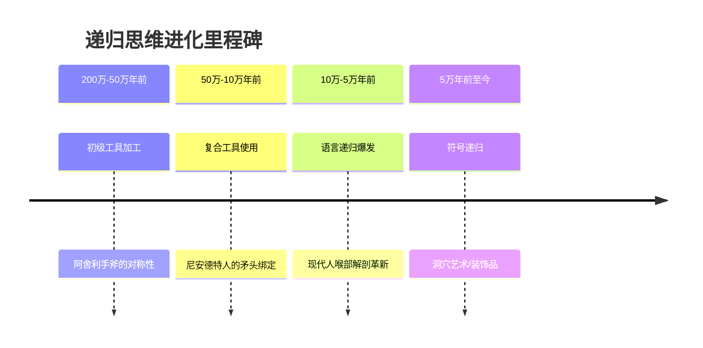

---

人类递归思维能力的起源是一个跨学科争议话题，目前的研究认为其发展经历了**从初步萌芽到系统化运用**的漫长过程，以下是基于考古学、神经科学和语言学的最新研究整合：

---

### ​**一、递归思维的定义与核心特征**​

递归（Recursion）指**将结构嵌套在同类结构中**的能力，表现为：

- ​**语言**​：生成无限复杂的句子（如"他知道她认为他们走了"）。
- ​**工具制造**​：多步骤加工（如石器嵌套修饰）。
- ​**社会认知**​：理解他人心理状态的多层嵌套（"A以为B不知道C喜欢D"）。

---

### ​**二、关键进化阶段与证据**​

#### ​**1. 早期萌芽（200万-50万年前）​**​

- ​**考古证据**​：
    - 奥尔德沃石器（Oldowan，250万年前）：单一敲击，无递归。
    - 阿舍利手斧（Acheulean，170万年前）：​**对称加工**需两步认知（先整体形状，再局部修整），体现初级递归。
- ​**神经科学**​：
    - 化石颅腔模型显示**前额叶皮层**​（BA10区）在直立人时期开始扩展，该区域与层级计划相关。

#### ​**2. 初步发展（50万-10万年前）​**​

- ​**尼安德特人**​：
    - 制造**复合工具**​（如将石刃绑在木柄上），需嵌套步骤：准备部件→组合→调整。
    - 但缺乏象征性递归（如没有多层装饰艺术）。
- ​**智人早期**​：
    - 南非Blombos洞穴（7.3万年前）的**刻痕赭石**显示重复图案，可能体现规则递归。

#### ​**3. 成熟爆发（10万-5万年前）​**​

- ​**语言递归**​：
    - 现代人类喉部解剖（舌骨）化石显示5万年前已适应复杂发音。
    - ​**句法递归**的间接证据：5万年前的珠链（需"穿孔→串接→排列"的多层指令）。
- ​**基因突变**​：
    - ​**FOXP2基因**​（与语言递归相关）在20万年前出现现代人变体。

---

### ​**三、关键争议点**​

1. ​**尼安德特人是否具备递归？​**​
    
    - 支持方：其复合工具和墓葬仪式可能需递归计划。
    - 反对方：其工具缺乏**无限嵌套**特征（如没有"工具的工具"）。
2. ​**语言与工具孰先？​**​
    
    - 乔姆斯基学派：递归源于语言基因突变（5万年内）。
    - 考古学派：石器加工中的递归早于语言（170万年前已存在）。

---

### ​**四、儿童发展研究佐证**​

- ​**实验心理学**​：
    - 3岁儿童能理解双层递归（"妈妈的鞋的盒子"），但需5岁才能处理三层。
    - 这与前额叶髓鞘化进程一致，支持递归的**神经发育基础**。

---

### ​**五、最新研究突破（2020s）​**​

1. ​**AI模型模拟**​：
    
    - 谷歌DeepMind发现，只有当神经网络具备**层级工作记忆**时，才能学会递归语法（类似人脑BA10区功能）。
2. ​**动物对比研究**​：
    
    - 倭黑猩猩能学习单层规则（如"如果A则B"），但无法处理"如果A则（如果B则C）"的嵌套。

---

### ​**六、综合时间线**​

mermaid

复制

---

### ​**结论**​

人类递归思维可能始于**170万年前的阿舍利工具制造**，但直到**5万年前的认知革命**才通过语言实现无限嵌套能力。这一过程依赖前额叶皮层的扩展和FOXP2基因的进化，最终使人类成为唯一能理解"无限层级抽象关系"的物种。

（如需具体考古遗址或神经成像研究文献，可进一步提供！） 🧠🔍

---

