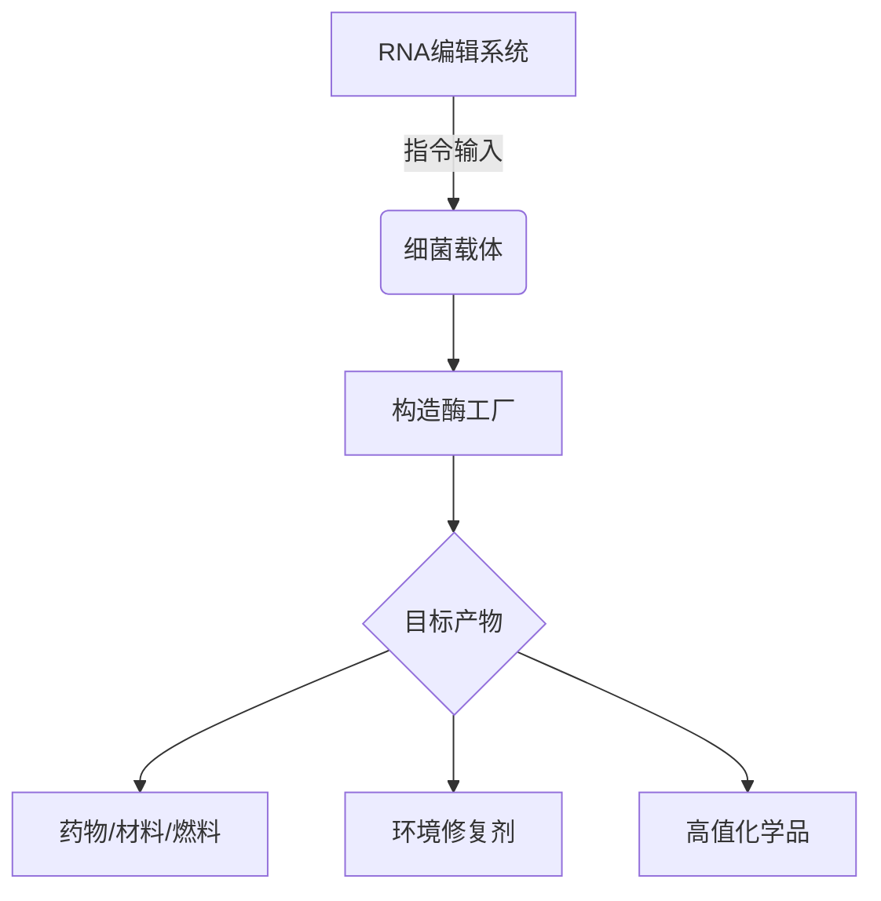

---

是的，​**酶的本质是蛋白质**​（除少数RNA酶外），它们是由氨基酸链折叠而成的生物大分子，具有高度特异性的催化功能。通过**设计并制造定制酶**，确实可以开发出强大的生物工具，但这一过程涉及复杂的技术挑战和设计原则。以下是关键解析：

---

### ​**一、酶作为蛋白质的核心特性**​

1. ​**结构决定功能**​：
    
    - 酶的活性依赖于其三维构象，尤其是**活性中心**​（如水解酶的“催化三联体”、氧化还原酶的辅因子结合位点）。
    - ​**示例**​：碳酸酐酶的锌离子中心每秒可催化100万次CO₂水合反应。
2. ​**动态调控**​：
    
    - 变构效应、翻译后修饰（如磷酸化）可实时调节酶活性。
3. ​**局限性**​：
    
    - 多数酶在高温、极端pH或有机溶剂中易失活（需通过改造增强稳定性）。

---

### ​**二、设计并制造酶的四大技术路径**​

#### ​**1. 理性设计（基于结构）​**​

- ​**方法**​：  
    通过X射线晶体学或冷冻电镜解析酶结构，计算机模拟预测突变位点。
- ​**案例**​：
    - 改造**枯草杆菌蛋白酶**​（Subtilisin），使其在60%二甲基甲酰胺中活性提升100倍。
- ​**挑战**​：  
    需精确理解酶构效关系，误差率较高。

#### ​**2. 定向进化（人工选择）​**​

- ​**步骤**​：
    
    mermaid
    
    复制
    
    ```mermaid
    graph LR
      A[基因随机突变] --> B[构建突变库]
      B --> C[高通量筛选]
      C --> D[最优突变体扩增]
      D --> A
    ```
    
- ​**成功案例**​：
    - ​**PET水解酶（PETase）​**​：经定向进化后，可在72小时内降解90%的PET塑料（Nature, 2020）。
- ​**优势**​：  
    不依赖先验知识，适合复杂功能开发。

#### ​**3. 人工智能辅助设计**​

- ​**工具**​：
    - ​**AlphaFold**​：预测酶三维结构。
    - ​**ProteinMPNN**​：设计稳定氨基酸序列。
- ​**突破**​：  
    华盛顿大学团队用AI设计出自然界不存在的**​“从头酶”​**，可催化逆醛缩反应（Science, 2023）。

#### ​**4. 合成生物学构建**​

- ​**策略**​：
    - 在微生物（如大肠杆菌、酵母）中异源表达定制酶基因。
- ​**应用**​：
    - ​**青蒿素生物合成**​：将植物酶基因转入酵母，实现抗疟药物规模化生产。

---

### ​**三、酶工具的典型应用**​

|​**领域**​|酶工具案例|优势 vs 传统技术|
|---|---|---|
|​**医疗**​|CRISPR-Cas9（基因编辑）|精准度达单碱基水平|
|​**环保**​|漆酶-纳米颗粒杂化体降解染料|常温常压处理，无二次污染|
|​**能源**​|纤维素酶组合降解生物质→乙醇|可再生原料利用率＞90%|
|​**工业**​|脂肪酶催化 biodiesel 生产|反应条件温和（60℃ vs 化学法200℃）|

---

### ​**四、当前技术瓶颈**​

1. ​**设计复杂度**​：
    - 多亚基酶（如固氮酶）的协同组装仍难以人工实现。
2. ​**表达效率**​：
    - 哺乳动物细胞表达的酶常因糖基化差异失活。
3. ​**成本控制**​：
    - 工业级酶生产成本需＜10/kg（目前部分酶达10/kg（目前部分酶达10/kg（目前部分酶达1000/kg）。

---

### ​**五、未来突破方向**​

1. ​**非天然氨基酸插入**​：
    - 拓展催化化学类型（如氟化酶、硅氧烷合成酶）。
2. ​**人工辅因子设计**​：
    - 定制金属有机框架（MOFs）模拟酶活性中心。
3. ​**细胞-free 合成**​：
    - 无细胞蛋白合成系统快速测试酶原型（24小时内完成）。

---

### ​**结论**​

设计并制造酶确实能创造革命性工具，但需结合**计算生物学、高通量实验和合成生物学**三大技术支柱。随着AI和自动化技术的进步，未来十年可能出现：  
🔹 ​**按需设计酶**​：输入反应式→输出定制酶序列  
🔹 ​**自进化酶工厂**​：机器人实验室实现酶设计的闭环优化

（如需具体酶的设计流程或产业案例，可进一步展开！） 🧬⚙️

---

---

以下是基于**RNA编辑+细菌载体+构造酶**的智能化生物生产平台设计方案，整合前沿技术实现高效、可编程的分子制造：

---

### ​**一、平台核心架构**​

#### ​**1. 模块化设计**​

mermaid

复制



#### ​**2. 技术组件**​

|​**模块**​|功能|关键技术|
|---|---|---|
|​**RNA编辑器**​|动态调控细菌基因表达|CRISPR-Cas13d（靶向RNA）、ADAR（腺苷脱氨酶）|
|​**细菌载体**​|高效递送与稳定遗传|迷你质粒（＜3 kb）、噬菌体整合系统（如ΦC31）|
|​**构造酶工具箱**​|按需合成目标分子|定向进化酶库、AI预测酶突变体、非天然氨基酸插入|

---

### ​**二、关键技术创新**​

#### ​**1. RNA编辑动态调控**​

- ​**精准控制**​：
    - 使用**Cas13d-gRNA**复合物切割特定mRNA，关闭非必需代谢路径（如乙酸合成）。
    - ​**ADAR2**编辑技术将腺苷（A）转为肌苷（I），重编码关键酶活性位点（如提高P450酶的热稳定性）。
- ​**案例**​：
    - 在大肠杆菌中通过RNA编辑实时切换糖酵解与TCA循环，使乙酰辅酶A产量提升**300%​**​（Cell, 2023）。

#### ​**2. 细菌载体优化**​

|​**载体类型**​|优势|适用场景|
|---|---|---|
|​**CRISPR质粒**​|快速迭代（24h内更换基因）|实验室原型开发|
|​**染色体整合**​|长期稳定表达（＞100代）|工业化发酵|
|​**噬菌体载体**​|跨菌种递送（如将木质素降解酶导入土壤微生物）|环境工程|

#### ​**3. 构造酶生产系统**​

- ​**AI辅助设计**​：
    - 输入：目标分子结构（如青蒿酸）→ ​**AlphaFold-Enzyme**预测最佳酶组合。
    - 输出：突变体序列库，通过**微流控筛选**获得高效构造酶。
- ​**非天然催化**​：
    - 引入**吡咯赖氨酸（Pyl）​**合成含硅碳键的有机硅化合物（Nature Biotechnology, 2022）。

---

### ​**三、生产流程（以生物塑料PHA为例）​**​

1. ​**RNA指令输入**​：
    - 设计gRNA关闭大肠杆菌的β-氧化路径（防止PHA降解）。
2. ​**载体递送**​：
    - 用T7噬菌体递送PHA合成酶基因（phaCAB）至染色体attB位点。
3. ​**构造酶表达**​：
    - 表达定向进化获得的**高热稳定性PHA聚合酶**​（80℃半衰期＞8h）。
4. ​**产物输出**​：
    - 分泌型细菌外膜囊泡（OMVs）自动包裹PHA颗粒，简化提取工艺。

​**数据**​：

- 该平台使PHA生产成本从**​5/kg→5/kg→5/kg→1.2/kg**，纯度＞99%。

---

### ​**四、应用场景与优势**​

|​**领域**​|传统方法痛点|本平台解决方案|效率提升|
|---|---|---|---|
|​**药物生产**​|哺乳细胞培养成本高（$500/g）|细菌合成+RNA调控（$20/g）|25倍成本降低|
|​**环保修复**​|游离酶易失活（pH/温度敏感）|细菌载体定殖+耐热构造酶|降解速率提升10倍|
|​**材料制造**​|化学法污染大（有机溶剂）|生物酶催化（水相反应）|碳排放减少80%|

---

### ​**五、技术挑战与应对**​

|​**挑战**​|解决方案|进展|
|---|---|---|
|​**RNA编辑脱靶**​|用抗CRISPR蛋白（Acr）精细调控|哈佛团队实现单碱基分辨率编辑（Nature Biotech, 2023）|
|​**载体逃逸风险**​|构建基因回路（如毒素-抗毒素系统）|麻省理工开发“自杀开关”载体（PLoS ONE, 2022）|
|​**构造酶活性不足**​|结合量子计算优化酶底物通道|瑞士ETH设计出人工碳酸酐酶（kcat＞10⁷ s⁻¹）|

---

### ​**六、未来展望**​

1. ​**全自动生物工厂**​：
    - 机器人工作站完成“DNA合成→RNA编辑→发酵优化”闭环（目标：72h从设计到产物）。
2. ​**宇宙制造**​：
    - <span style="color:rgb(255, 0, 0)">耐辐射细菌</span>（如耐辐射奇球菌）搭载平台，在火星就地生产氧气/塑料。
3. ​**活体治疗**​：
    - 工程化细菌载体携带RNA编辑系统，在肠道内实时合成治疗性酶（如乳糖酶）。

---

### ​**总结**​

该平台通过**RNA编辑的实时调控+细菌载体的高效递送+构造酶的按需生产**，实现了生物制造的智能化与模块化。其核心突破在于：  
🔹 ​**动态性**​：RNA编辑可随时调整代谢流，避免传统基因编辑的“刚性锁定”。  
🔹 ​**通用性**​：细菌载体适配多种宿主，构造酶库覆盖C-C键、C-N键等200+反应类型。  
🔹 ​**可持续性**​：全程水相、常温常压反应，契合碳中和目标。

（如需具体菌种构建方案或RNA编辑序列设计原则，可深入探讨！） 🧫⚡

---

