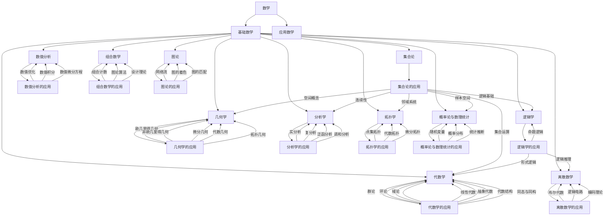

---

#集合

[[373ca2e7c48c5a8997d968003d583b79_MD5.png|Open: Pasted image 20240610104610.png]]
![[373ca2e7c48c5a8997d968003d583b79_MD5.png]]

Notation
Properties

> 应该和我的职业有关，这个定义更能触动我。程序员对Property非常敏感。
> 虽然不同的描述不影响最终的理解，但是，不同的描述产生的思维是不同的。这不是准确性的问题。从不同的窗口看同一间屋子，也许看到了相同的内容，但是，角度还是有些差别的。特别是定义这种比较核心的东西，对理解事物非常关键。定义还能“锁死”思维。不同的定义能产生不同的视角。
> 如果是这个定义，集合不需要是数学上的，当然，在数学上最严谨。
> 
> 程序员应该更容易对系统论理解很深刻。

[[34ba7a37c75f41cd5a1a55370c6abbef_MD5.png|Open: Pasted image 20240610105605.png]]
![[34ba7a37c75f41cd5a1a55370c6abbef_MD5.png]]

> 这里并不影响理解，但是，不能丢掉前面的Notation，而直接说是用属性来定义。需要先描述元素本身，这里的属性不是用来定义元素的，或者不能独立定义元素。
> 而且N本来就是个集合。

---

#笛卡尔积

集合的笛卡尔积（Cartesian product），不是“相乘”，是数学中描述两个集合之间所有可能的有序对（或元组）的概念。如果有两个集合 \( A \) 和 \( B \)，它们的笛卡尔积定义为所有可能的有序对 \( (a, b) \) 的集合，其中 \( a \) 属于 \( A \)，\( b \) 属于 \( B \)。

笛卡尔积通常表示为 \( A \times B \)，其元素是形式为 \( (a, b) \) 的有序对，其中每个 \( a \) 是集合 \( A \) 的元素，每个 \( b \) 是集合 \( B \) 的元素。

以下是笛卡尔积的一些性质：

1. **定义**：集合 \( A \) 和 \( B \) 的笛卡尔积是所有形如 \( (a, b) \) 的有序对的集合，记作 \( A \times B = \{(a, b) \mid a \in A, b \in B\} \)。

2. **元素的有序性**：笛卡尔积中的元素是有序的，即有序对 \( (a, b) \) 和 \( (b, a) \) 是不同的，除非 \( a = b \)。

3. **大小**：如果集合 \( A \) 有 \( m \) 个元素，集合 \( B \) 有 \( n \) 个元素，那么它们的笛卡尔积 \( A \times B \) 将有 \( m \times n \) 个元素。

4. **无限集合**：笛卡尔积的概念同样适用于无限集合。例如，实数集 \( \mathbb{R} \) 与自身的笛卡尔积 \( \mathbb{R} \times \mathbb{R} \) 可以表示为所有实数有序对的集合。

5. **推广**：笛卡尔积可以推广到多个集合的情况。例如，如果有三个集合 \( A \)，\( B \) 和 \( C \)，它们的笛卡尔积是 \( A \times B \times C \)。

6. **空间和几何**：在几何和空间中，笛卡尔积可以用来表示点的坐标系，如二维平面上的点可以表示为 \( (x, y) \)，其中 \( x \) 和 \( y \) 分别属于实数集。

7. **关系和函数**：笛卡尔积在定义关系和函数中也扮演重要角色，可以用来描述两个集合之间的所有可能联系。

8. **笛卡尔平面**：在坐标几何中，笛卡尔平面是由两个正交的数轴组成的，每个点由一个有序对 \( (x, y) \) 定义。

9. **高维空间**：笛卡尔积可以用来构造高维空间，例如 \( \mathbb{R}^n \) 可以看作是 \( n \) 个实数的笛卡尔积。

笛卡尔积是数学中的一个基本概念，它在多个领域，包括代数学、几何学、拓扑学、计算机科学等都有广泛的应用。

> 地层学习法
> 虽然不难想到集合和坐标系的关系。但是，分开学习和放到一起学习是不一样的，一起学习能在记忆上产生强连接。只是不能无限去展开，那样就“飞”了。
> 如果不把看起来独立的东西放到一起思考过，那它们永远都是独立的。这样可以“硬性”的创造关联。能自己想到当然很好，不过这是一种稀有能力，没有的话，就去制造。

---

> 注意，GPT类工具只负责辅助理解，并不严谨。能看，但是不能太较真。
> 在辅助理解上，足够。但是，不能认为它给的是可靠的。
> 
> 虽然有很多缺陷，但是整体上是有用的，不能排斥它。

---

#集合映射

集合上的映射关系，通常指的是数学中的函数概念。函数是定义在集合上的一个规则，它将一个集合中的元素（称为定义域）映射到另一个集合的元素（称为值域）。以下是一些基本的映射关系类型：

1. **单射（Injective）**：如果函数\( f: A \rightarrow B \)满足对于所有\( a_1, a_2 \in A \)，当\( a_1 \neq a_2 \)时，有\( f(a_1) \neq f(a_2) \)，则称\( f \)是单射的，也称为一一映射。

2. **满射（Surjective）**：如果函数\( f: A \rightarrow B \)满足对于所有\( b \in B \)，都存在至少一个\( a \in A \)使得\( f(a) = b \)，则称\( f \)是满射的，也称为到上映射。

3. **双射（Bijective）**：如果函数\( f: A \rightarrow B \)既是单射又是满射，则称\( f \)是双射的，也称为一一对应。

4. **平凡映射（Identity Map）**：函数\( f: A \rightarrow A \)定义为对于所有\( a \in A \)，\( f(a) = a \)。它是单射和满射。

5. **常数映射（Constant Map）**：函数\( f: A \rightarrow B \)定义为对于所有\( a \in A \)，\( f(a) \)是一个固定的元素\( c \in B \)。

6. **逆映射（Inverse Map）**：如果函数\( f: A \rightarrow B \)是双射的，那么存在一个函数\( f^{-1}: B \rightarrow A \)，使得对于所有\( a \in A \)和\( b \in B \)，\( f^{-1}(f(a)) = a \)和\( f(f^{-1}(b)) = b \)。

7. **线性映射（Linear Map）**：在向量空间的上下文中，如果函数\( f: V \rightarrow W \)满足对于所有\( v_1, v_2 \in V \)和所有标量\( c \)，有\( f(cv_1 + v_2) = cf(v_1) + f(v_2) \)，则称\( f \)是线性映射。

8. **同态映射（Homomorphism）**：在代数结构（如群、环、域等）的上下文中，如果函数\( f: A \rightarrow B \)保持结构操作，即对于所有\( a_1, a_2 \in A \)，有\( f(a_1 \cdot a_2) = f(a_1) \cdot f(a_2) \)，则称\( f \)是同态映射。

9. **同构映射（Isomorphism）**：如果同态映射\( f: A \rightarrow B \)是双射的，则称\( f \)是同构映射，它将一个代数结构映射到另一个结构上，并且保持所有结构特性。

10. **自映射（Endomorphism）**：函数\( f: A \rightarrow A \)，即定义域和值域是同一个集合的映射。

这些映射类型在数学的不同领域中有着广泛的应用，包括代数、几何、拓扑学等。

---

#集合映射

在集合论和数学的其他领域，集合上的映射（也称为函数）是将一个集合的元素关联到另一个集合元素的规则。以下是一些常见的映射关系及其属性：

### 1. 单射（Injective Function）

单射是指一种映射，其中不同的元素被映射到不同的元素上。这意味着没有两个不同的元素会映射到同一个元素。

**定义**: 映射 \( f: A \rightarrow B \) 是单射的，当且仅当对所有 \( a_1, a_2 \in A \)，如果 \( f(a_1) = f(a_2) \)，则 \( a_1 = a_2 \)。

**性质**:
- 单射保证每个元素在目标集合中至多被映射一次。
- 示例：\( f(x) = 2x \) 是从实数集 \(\mathbb{R}\) 到实数集 \(\mathbb{R}\) 的单射。

### 2. 满射（Surjective Function）

满射是指一种映射，其中目标集合中的每个元素至少有一个原像。这意味着每个元素在目标集合中都有一个对应的原象在原集合中。

**定义**: 映射 \( f: A \rightarrow B \) 是满射的，当且仅当对所有 \( b \in B \)，存在至少一个 \( a \in A \)，使得 \( f(a) = b \)。

**性质**:
- 满射保证目标集合中的每个元素至少被映射一次。
- 示例：\( f(x) = x^2 \) 是从实数集 \(\mathbb{R}\) 到非负实数集 \(\mathbb{R}^+\) 的满射。

### 3. 双射（Bijective Function）

双射是同时具有单射和满射性质的映射。这意味着映射既是单射又是满射，因此每个元素在目标集合中恰好有一个对应的原像。

**定义**: 映射 \( f: A \rightarrow B \) 是双射的，当且仅当它是单射且满射。

**性质**:
- 双射保证每个元素在目标集合中恰好被映射一次。
- 示例：\( f(x) = x \) 是从实数集 \(\mathbb{R}\) 到实数集 \(\mathbb{R}\) 的双射。

### 4. 恒等映射（Identity Function）

恒等映射是将每个元素映射到其自身的映射。

**定义**: 对于集合 \( A \)，恒等映射 \( id_A: A \rightarrow A \) 定义为 \( id_A(x) = x \) 对所有 \( x \in A \)。

**性质**:
- 恒等映射是一个特殊的双射。
- 示例：在集合 \(\{1, 2, 3\}\) 上的恒等映射是将每个元素映射到其自身。

### 5. 常值映射（Constant Function）

常值映射是将所有元素映射到同一个元素的映射。

**定义**: 映射 \( f: A \rightarrow B \) 是常值映射的，当且仅当存在 \( b \in B \)，使得对所有 \( a \in A \)，有 \( f(a) = b \)。

**性质**:
- 常值映射不是单射，但可以是满射（取决于目标集合的结构）。
- 示例：\( f(x) = 3 \) 是从实数集 \(\mathbb{R}\) 到 \(\{3\}\) 的常值映射。

### 6. 逆映射（Inverse Function）

逆映射是将目标集合中的元素映射回原集合的映射，前提是原映射是双射。

**定义**: 如果 \( f: A \rightarrow B \) 是一个双射，那么存在逆映射 \( f^{-1}: B \rightarrow A \)，使得对所有 \( a \in A \) 和 \( b \in B \)，有 \( f(f^{-1}(b)) = b \) 和 \( f^{-1}(f(a)) = a \)。

**性质**:
- 逆映射保证双向的一一对应。
- 示例：如果 \( f(x) = 2x \)，那么 \( f^{-1}(y) = \frac{y}{2} \)。

### 7. 自同态（Endomorphism）和自同构（Automorphism）

自同态是从一个集合到其自身的映射，保留某种结构（如代数结构）。如果该映射是双射，则称为自同构。

**定义**: 
- 自同态：映射 \( f: A \rightarrow A \)，保持集合 \( A \) 的结构。
- 自同构：自同态映射 \( f: A \rightarrow A \) 是一个双射。

**性质**:
- 自同构具有逆映射，是结构保持的双射。
- 示例：在矩阵集合上，矩阵的自同构是可逆矩阵。

以上是集合上的几种常见映射关系，每种映射在不同的数学领域中都有其重要应用和特定的性质。

---

#现代数学图谱

现代数学是一个非常广泛且复杂的领域，包含了许多子领域和分支，它们之间存在着相互依赖和交叉应用。下面是一个简化的现

代数学图谱，展示了一些主要的数学分支及其依赖关系和应用领域：

这个图谱展示了数学的一些主要分支及其相互关系。每个分支都有其特定的应用领域：

- **集合论**：是现代数学的基础，用于定义数学对象和结构。
- **逻辑学**：在计算机科学、人工智能等领域有广泛应用。
- **代数学**：在密码学、编码理论、量子力学等领域有重要应用。
- **几何学**：在物理学、工程学、计算机图形学等领域有重要应用。
- **分析学**：在物理学、工程学、经济学等领域有广泛应用。
- **拓扑学**：在物理学、生物学、材料科学等领域有应用。
- **概率论与数理统计**：在金融、保险、社会科学等领域有广泛应用。
- **数值分析**：在工程学、物理学、计算机科学等领域有应用。
- **组合数学**：在计算机科学、优化问题、网络理论等领域有应用。
- **图论**：在网络科学、运筹学、社会学等领域有应用。
- **离散数学**：在计算机科学、信息论、密码学等领域有广泛应用。

请注意，这个图谱是非常简化的，实际的数学领域更加复杂，分支更多，相互之间的联系也更加紧密。此外，许多数学分支都有交叉应用，不仅仅局限于上述领域。

---

#恒等映射

恒等映射（Identity Map）是一种特殊的函数，它将集合中的每个元素映射到其自身。对于任何集合\( A \)，恒等映射通常表示为\( \text{id}_A \)或简单地\( \text{id} \)，定义为对于所有\( a \in A \)，\( \text{id}(a) = a \)。恒等映射在数学的多个领域中都有其用途和重要性：

1. **基础定义**：恒等映射是映射概念的一个基本例子，有助于初学者理解映射的基本概念。

2. **代数结构**：在代数结构（如群、环、域等）中，恒等元素（例如群的单位元）与恒等映射紧密相关。恒等映射本身可以看作是保持结构不变的特殊同态。

3. **线性代数**：在线性代数中，恒等映射对应于恒等矩阵。恒等矩阵在矩阵运算中起到与数字1在标量乘法中相同的作用，是矩阵加法的单位元，并且与任何矩阵相乘都会得到该矩阵本身。

4. **函数的复合**：在函数的复合中，恒等映射起着单位元的作用。对于任何函数\( f: A \rightarrow B \)，有\( f \circ \text{id}_A = f \)和\( \text{id}_B \circ f = f \)，这表明恒等映射不会改变函数的值。

5. **拓扑学**：在拓扑学中，恒等映射是连续的，并且是拓扑空间之间的同胚映射的一个特例，它保持了空间的所有拓扑性质。

6. **变换的恒等性**：在几何学和物理学中，恒等映射可以表示没有发生任何变换的情况，例如在坐标变换或物理系统的状态变化中。

7. **程序设计**：在计算机科学和程序设计中，恒等函数经常用作默认操作或作为函数参数的占位符，以保持代码的通用性和灵活性。

8. **证明中的辅助工具**：在数学证明中，恒等映射经常被用作证明策略的一部分，特别是在证明某些性质对于所有映射都成立时。

9. **自映射的特例**：恒等映射是自映射（Endomorphism）的一个特例，即映射将集合中的元素映射回同一集合。

10. **数学建模**：在数学建模中，恒等映射可以表示某些量或变量在特定条件下保持不变。

恒等映射虽然简单，但由于其保持元素不变的特性，它在数学的许多领域中都扮演着重要的角色。

---

#常值映射

常值映射（Constant Map）是一种函数，它将定义域中的所有元素映射到同一个固定的值域元素。也就是说，对于函数\( f: A \rightarrow B \)，存在某个\( c \in B \)，使得对于所有\( a \in A \)，都有\( f(a) = c \)。

常值映射在数学和计算机科学中有多种用途：

1. **简化问题**：在某些情况下，将复杂的问题简化为常值映射可以帮助我们更容易地理解和解决问题。

2. **作为基线**：在分析函数或系统的行为时，常值映射可以作为一个基线，用来比较其他更复杂映射的行为。

3. **代数结构**：在代数结构中，常值映射可以用来研究结构的属性，例如在群论中，常值映射可以帮助我们理解群的恒等元素。

4. **函数的极限**：在分析学中，常值映射可以用来定义函数的极限，例如，如果一个函数序列或级数的极限是一个常值，那么这个函数序列或级数是收敛的。

5. **概率论**：在概率论中，常值映射可以用来定义几乎必然事件，即发生概率为1的事件。

6. **计算机科学**：在编程中，常值函数可以作为默认操作，或者在某些算法中用来初始化变量。

7. **控制理论**：在控制理论中，常值映射可以表示系统在没有输入时的稳态行为。

8. **优化问题**：在优化问题中，常值映射可以用来表示一个不变的目标函数，这在某些情况下可以简化优化过程。

9. **教学和解释**：在教学中，常值映射可以用来向学生解释映射和函数的基本概念。

10. **数学建模**：在数学建模中，常值映射可以用来模拟某些物理量或参数在特定条件下保持不变的情况。

尽管常值映射看起来很简单，但在理论和实际应用中，它都扮演着重要的角色，帮助我们理解和处理各种数学和工程问题。

---

#函数序列

函数序列是数学中的一个概念，指的是一系列按特定顺序排列的函数。具体来说，如果\( \{f_n\} \)是定义在集合\( A \)上的函数序列，那么对于每个自然数\( n \)，都有一个函数\( f_n: A \rightarrow B \)，其中\( A \)和\( B \)是任意的集合。函数序列可以表示为：

\[ f_1, f_2, f_3, \ldots \]

这里的每个\( f_n \)都是从集合\( A \)到集合\( B \)的一个映射。函数序列在数学的不同领域中有着不同的应用和研究重点：

1. **点列的极限**：在分析学中，如果每个\( f_n \)都是定义在实数集上的函数，那么可以研究这些函数在某一点\( x \)的值的序列，比如\( \{f_n(x)\} \)，其极限可能存在，这有助于研究函数的行为。

2. **函数空间**：在泛函分析中，函数序列可以看作是函数空间中的元素，研究函数序列的性质，如收敛性、连续性、紧性等。

3. **傅里叶级数**：在傅里叶分析中，函数可以表示为三角函数序列的和，这个序列就是函数的傅里叶级数。

4. **数值分析**：在数值分析中，函数序列可以用于近似计算，例如，多项式序列可以用来近似复杂的函数。

5. **概率论**：在概率论中，随机变量序列可以看作是函数序列，研究这些序列的极限行为有助于理解随机过程。

6. **动力系统**：在动力系统中，函数序列可以代表迭代过程，研究序列的极限行为有助于理解系统的长期行为。

7. **优化问题**：在优化问题中，函数序列可以代表一系列优化目标或约束条件，通过研究序列的性质来寻找最优解。

8. **计算机科学**：在算法设计中，函数序列可以用于描述算法的迭代过程，比如在迭代算法中逐步逼近解。

9. **经济学和统计学**：在这些领域中，函数序列可以用于模型预测，比如时间序列分析。

函数序列的概念非常通用，其具体含义和应用取决于上下文和所研究的数学领域。

---

#复合函数

在数学中，\( f \circ g : R \rightarrow T \) 表示函数\( f \)和\( g \)的复合，其中\( g \)的值域是\( f \)的定义域的子集。具体来说：

1. \( g: R \rightarrow S \) 是一个函数，将集合\( R \)中的元素映射到集合\( S \)。
2. \( f: S \rightarrow T \) 是一个函数，将集合\( S \)中的元素映射到集合\( T \)。
3. \( f \circ g \) 表示先应用函数\( g \)，然后将结果作为\( f \)的输入。如果\( x \)是集合\( R \)中的元素，那么\( (f \circ g)(x) \) 首先计算\( g(x) \)，然后将这个结果代入\( f \)中。

复合函数\( f \circ g \)的定义域是集合\( R \)中所有使得\( g(x) \)属于\( S \)的\( x \)的集合，因为只有当\( g(x) \)在\( S \)中时，\( f(g(x)) \)才有意义。值域是集合\( T \)，因为\( f \)将\( S \)中的每个元素映射到\( T \)。

简而言之，\( f \circ g : R \rightarrow T \) 表示一个从集合\( R \)到集合\( T \)的函数，它是通过先应用函数\( g \)，再应用函数\( f \)得到的。这种操作在数学的许多领域中都非常常见，包括代数、分析、拓扑学等。

---

#集合映射定义

Definition. Let S and T be two sets,and f : S → T be a map.  
1. We say that S is the domain of f and T is the codomain of f.  
2. We say that f is the identity map if S = T and f(x) = x, ∀x ∈ S. In this case we  
write f = IdS.  
3. f is injective if f(x) = f(y) ⇒ x = y ∀ x, y ∈ S.  
4. f is surjective if given y ∈ T, there exists x ∈ S such that f(x) = y.  
5. If f is both injective and surjective we say it is bijective. Intuitively this means f gives  
a perfect matching of elements in S and T.

> f: S -> T
> 理解它的时候被函数先入为主了。
> 这里的集合是比较宽松的。不是说是函数的定义域和值域。但是这种写法觉得有点别扭。
> 比如：
> f(x) = 2 * y, x, y ∈ R
> 这个映射可以写成是：
> f: R -> R

---

Let S and T be two sets. Let f be a map from S to T. Show that  
f is a bijection if and only if there exists a map g from T to S such that f ◦ g = IdT and  
g ◦ f = IdS.

To show that a map \( f: S \to T \) is a bijection if and only if there exists a map \( g: T \to S \) such that \( f \circ g = \text{Id}_T \) and \( g \circ f = \text{Id}_S \), we will prove it in two parts: the "if" direction and the "only if" direction.

> 虽然不能说一定是GPT在思考、在决策。但是，表现出来像是在思考。它在拆解问题，明确关系，然后逐个解决。

### "If" Direction

Assume that there exists a map \( g: T \to S \) such that \( f \circ g = \text{Id}_T \) and \( g \circ f = \text{Id}_S \). We need to show that \( f \) is a bijection.

1. **\( f \) is injective**:
   - Suppose \( f(a_1) = f(a_2) \) for \( a_1, a_2 \in S \).
   - Apply \( g \) to both sides: \( g(f(a_1)) = g(f(a_2)) \).
   - Using \( g \circ f = \text{Id}_S \), we get \( a_1 = \text{Id}_S(a_1) = g(f(a_1)) \) and \( a_2 = \text{Id}_S(a_2) = g(f(a_2)) \).
   - Thus, \( a_1 = a_2 \).
   - Therefore, \( f \) is injective.

2. **\( f \) is surjective**:
   - For any \( b \in T \), consider \( f(g(b)) \).
   - Using \( f \circ g = \text{Id}_T \), we have \( f(g(b)) = \text{Id}_T(b) = b \).
   - Hence, every \( b \in T \) has a preimage \( g(b) \in S \).
   - Therefore, \( f \) is surjective.

Since \( f \) is both injective and surjective, it is a bijection.

> 先证明了if，下面就可以使用证明出来的结论。

### "Only if" Direction

Assume that \( f: S \to T \) is a bijection. We need to show that there exists a map \( g: T \to S \) such that \( f \circ g = \text{Id}_T \) and \( g \circ f = \text{Id}_S \).

1. **Existence of \( g \)**:
   - Since \( f \) is a bijection, it has an inverse function \( f^{-1}: T \to S \).
   - Define \( g = f^{-1} \).

2. **Verify the conditions**:
   - **\( f \circ g = \text{Id}_T \)**:
     - For any \( b \in T \), \( f(g(b)) = f(f^{-1}(b)) \).
     - By definition of the inverse function, \( f(f^{-1}(b)) = b \).
     - Hence, \( f \circ g = \text{Id}_T \).

   - **\( g \circ f = \text{Id}_S \)**:
     - For any \( a \in S \), \( g(f(a)) = f^{-1}(f(a)) \).
     - By definition of the inverse function, \( f^{-1}(f(a)) = a \).
     - Hence, \( g \circ f = \text{Id}_S \).

Therefore, if \( f \) is a bijection, the map \( g = f^{-1} \) satisfies \( f \circ g = \text{Id}_T \) and \( g \circ f = \text{Id}_S \).

### Conclusion

We have shown both directions of the equivalence:

- If there exists a map \( g: T \to S \) such that \( f \circ g = \text{Id}_T \) and \( g \circ f = \text{Id}_S \), then \( f \) is a bijection.
- If \( f \) is a bijection, then there exists a map \( g = f^{-1}: T \to S \) such that \( f \circ g = \text{Id}_T \) and \( g \circ f = \text{Id}_S \).

Thus, \( f \) is a bijection if and only if such a map \( g \) exists.

> 不能只想着赚钱。就差在最后一点距离上，但是，看似距离近，差别巨大。投入巨大只提升一点点会被认为“不值”。大部分情况下，这么想没什么，毕竟没什么大不了的结果。但是，如果是竞争或者竞技的话，那就不一样了。

> 也许，技术发展就是激进的商业行为推动的。不做也能活，做差不多也能活，所以，就不是很有动力去做这样的事。虽然都是为了利益，但是，高风险的行为似乎也不是完全没有意义的。激进的做法更像是在赌，确实不是好的做法，正常人不会首先选择这么做。但是，似乎不是正常人在推动发展。

---

#结合律

The significance of the Associativity laws is that summing and multiplying a finite  
collection of integers makes sense, i.e. is independent of how we do it.

这句话的意思是，结合律的重要性在于它保证了对一组整数进行加法或乘法运算时，最终结果是有意义的，并且与我们执行运算的具体顺序无关。

让我们深入理解一下这句话：

1. **有意义的结果**：结合律保证了无论我们如何组合这些整数进行加法或乘法，总能得到一个确定的结果。这意味着，对于任何整数集合和相应的二元运算（加法或乘法），运算的最终结果都是明确定义的。

2. **独立于执行顺序**：当我们对一组整数进行加法或乘法运算时，结合律允许我们自由地分组这些整数，而不必担心这会影响最终结果。换句话说，我们可以先计算某些整数的和或乘积，然后再将这些中间结果与其他整数或中间结果组合，而不会影响最终的总和或乘积。

例如：
- 对于加法：\( (1 + 2) + 3 = 1 + (2 + 3) \)。无论我们是先将1和2相加，再加上3，还是先将2和3相加，再加上1，最终的和都是6。
- 对于乘法：\( (2 \times 3) \times 4 = 2 \times (3 \times 4) \)。无论我们是先将2和3相乘，再乘以4，还是先将3和4相乘，再乘以2，最终的乘积都是24。

结合律的存在使得我们可以在进行数学运算时更加灵活，不必担心中间步骤的顺序，从而简化了计算过程，并在数学理论中提供了坚实的基础。这种性质在解决复杂数学问题时尤为重要，因为它允许我们将问题分解成更小的部分，然后重新组合这些部分以求解整个问题，而不必担心组合方式对最终结果的影响。

---

#质数

质数是数学中的一类特殊整数，它们在数论和其他科学领域中有着广泛的应用和重要性。以下是研究质数的一些主要用途：

1. **数论基础**：质数是数论研究的基础，因为它们是整数的基本构建块。每个大于1的整数都可以唯一地分解为质数的乘积。

2. **密码学**：在现代密码学中，质数在公钥加密算法（如RSA加密算法）中发挥着关键作用。这些算法的安全性依赖于大质数的乘积，其分解难度被认为是计算上不可行的。

3. **计算机科学**：质数在算法设计和数据结构中有着应用，例如素数在哈希函数设计和随机数生成器中可以提高性能和安全性。

4. **通信技术**：在通信领域，质数在调制解调技术中用于生成正交信号，有助于提高数据传输的效率和可靠性。

5. **物理学**：在物理学中，质数有时与基本物理常数和粒子的性质相关联，例如在量子力学和弦理论中。

6. **优化问题**：质数在解决某些类型的优化问题中发挥作用，如在整数规划和组合优化中。

7. **音乐理论**：质数在音乐理论中与音阶和和声结构有关，它们有助于解释音乐的数学基础。

8. **生物学**：在生物学中，质数与某些生物现象有关，例如在植物的叶序排列中。

9. **随机性研究**：质数在研究随机性和伪随机性中也有应用，它们有助于生成更高质量的随机序列。

10. **教育和普及**：质数的概念在数学教育中用于培养学生的逻辑思维和解决问题的能力。

11. **数学挑战和竞赛**：质数问题经常出现在数学竞赛和挑战中，激发人们对数学的兴趣和探索精神。

12. **理论研究**：质数的分布和性质是数学家研究的永恒主题，如哥德巴赫猜想和孪生质数猜想等。

研究质数不仅是为了它们的实际应用，还因为它们在数学理论中的美丽和神秘，以及它们在自然界和科学中的普遍存在。质数的研究推动了数学的发展，并继续激发着新的数学思想和应用。

---

#质数

研究质数（prime numbers）在数学和应用领域中有广泛而深远的影响，涵盖了纯数学、计算机科学、密码学、物理学等多个领域。以下是质数研究的一些主要用途和意义：

### 1. 数论和纯数学研究

质数是数论的基础。数论研究整数的性质，而质数作为最基本的“构造块”，是所有整数的基本构成单位（通过质因数分解）。

- **质因数分解**：任何大于1的整数都可以唯一分解为若干质数的乘积，这一性质是数论中的基本定理，即算术基本定理。
- **解析数论**：研究质数在整数中的分布规律，比如素数定理（Prime Number Theorem），描述了质数的渐近分布。

### 2. 密码学

质数在现代密码学中起着核心作用，尤其是在公钥密码系统中。两个主要的公钥密码系统是RSA和椭圆曲线密码术，它们的安全性依赖于质数的某些数学性质。

- **RSA加密**：RSA算法利用了大整数分解为质因数的难度。生成RSA密钥时，需要找到两个大质数，并且将它们的乘积用于密钥生成。
- **椭圆曲线密码术**：依赖于椭圆曲线上的点的离散对数问题，其中质数的选择影响曲线的安全性。

### 3. 计算机科学和算法设计

质数在计算机科学中用于多种算法和数据结构的设计。

- **哈希函数**：许多哈希函数使用质数来减少冲突，提高散列效果。
- **随机数生成器**：质数用于设计高效的伪随机数生成器，这对于模拟、加密和统计应用至关重要。
- **算法优化**：质数在某些算法的优化中起作用，比如快速素数测试算法（如Miller-Rabin素数测试）。

### 4. 通信和网络安全

质数在安全通信和网络协议设计中发挥作用。

- **安全协议**：许多安全协议依赖于质数，比如Diffie-Hellman密钥交换协议。
- **密码学硬件设计**：质数用于设计专用集成电路（ASIC）和硬件加速器，以实现高效的加密解密操作。

### 5. 数学应用和理论物理

质数在某些物理系统和理论中出现，提供了深刻的数学和物理联系。

- **量子计算**：研究质数和因数分解问题是量子计算的一个重要应用领域，例如Shor算法，用于在量子计算机上高效因数分解。
- **混沌理论**：质数的分布与某些混沌系统中的现象有类似的数学结构。

### 6. 教育和科学研究

质数研究有助于培养逻辑思维和解决问题的能力，推动科学研究的发展。

- **数学教育**：质数问题是数学教育中的经典问题，激发学生对数学的兴趣和理解。
- **研究前沿**：质数问题，如孪生素数猜想和黎曼假设，仍然是数学研究的前沿领域，推动了数学理论的发展。

### 7. 实际应用

质数也有一些直接的实际应用。

- **条形码和二维码**：某些编码系统使用质数来确保数据的完整性和有效性。
- **分布式系统**：在分布式系统和并行计算中，质数用于调度和负载平衡算法。

总之，质数研究不仅在理论数学中具有重要意义，而且在信息安全、计算机科学、物理学等诸多领域有着广泛的应用。研究质数推动了许多科学和技术的发展，同时也提供了丰富的数学问题供进一步探索。

---

#质数和混沌系统

质数和混沌系统在数学上看似是两个不相关的领域，但实际上它们之间存在着一些有趣的联系。这些联系主要体现在数学结构和理论层面上，尤其是在数论和动力系统的研究中。以下是一些质数与混沌系统之间关系的点：

1. **素数定理与混沌**：素数定理描述了质数在自然数中的分布密度。它指出质数的密度大约是1/ln(n)，其中n是自然数。混沌理论研究的是在确定性系统中出现的、看似随机的行为。素数定理的证明涉及到复分析中的解析延拓，而解析延拓的概念在混沌理论中也有所体现。

2. **动力系统中的质数**：在动力系统中，某些映射（如Arnold's cat map）与模n的剩余类有关，其中n可以是质数。动力系统中的迭代映射可以用来研究数的轨道，质数在这个过程中扮演了重要角色。

3. **混沌映射与质数**：某些混沌映射，如Logistic映射或Hénon映射，当参数取特定值时，可以展现出混沌行为。这些映射在密码学中的应用与质数的性质有关，因为质数在加密算法中是构建混沌系统的基础。

4. **随机性与质数**：混沌系统的一个重要特征是其输出的不可预测性和随机性。质数在生成伪随机数序列中也有应用，因为质数序列的分布特性可以用来生成高质量的随机数。

5. **数学结构中的混沌**：在某些数学结构中，如分形和复动力系统，混沌现象是研究的重点。质数在这些结构的生成和性质中起着作用，例如在分形的迭代函数系统中。

6. **密码学中的混沌与质数**：在密码学中，混沌理论和质数都非常重要。混沌理论可以用于设计加密算法，而质数则用于生成密钥，如RSA加密算法中的大质数乘积。

7. **数学证明中的混沌元素**：某些数学证明，特别是涉及质数分布的证明，可能会用到类似于混沌理论中的某些思想，如遍历理论和拓扑动力系统。

尽管质数和混沌系统在直观上似乎没有直接联系，但在数学的深层次结构中，它们之间存在着一些微妙的相互作用。这些联系在理论研究中非常重要，并且有助于推动数学的多个领域的发展。

---

#欧几里德引理

欧几里德引理（Euclid's Lemma）在数论中是一个重要的定理，特别是在质数相关的讨论中。它表明，如果一个质数整除两个数的乘积，则它必须整除其中至少一个数。具体来说：

**欧几里德引理**:
如果 \( p \) 是一个质数，并且 \( p \mid ab \)，那么 \( p \mid a \) 或 \( p \mid b \)。

我们通过反证法来证明这个引理。

### 证明

假设 \( p \) 是一个质数，并且 \( p \mid ab \)。我们要证明 \( p \mid a \) 或 \( p \mid b \)。我们采用反证法，假设 \( p \nmid a \) 和 \( p \nmid b \)，然后得到矛盾。

1. **假设**:
   - \( p \mid ab \)
   - \( p \nmid a \)
   - \( p \nmid b \)

2. **反证法**:
   - 因为 \( p \nmid a \)，所以 \( a \) 和 \( p \) 互质，即 \( \gcd(a, p) = 1 \)。

3. **利用裴蜀定理**（Bézout's Identity）:
   - 由于 \( \gcd(a, p) = 1 \)，根据裴蜀定理，存在整数 \( x \) 和 \( y \)，使得：
     \[
     ax + py = 1
     \]

4. **两边乘以 \( b \)**:
   - \( b(ax + py) = b \)
   - 展开得：
     \[
     abx + pby = b
     \]

5. **利用 \( p \mid ab \)**:
   - 由于 \( p \mid ab \)，所以 \( ab = pk \) 对某个整数 \( k \) 成立。
   - 将上式代入得：
     \[
     pkx + pby = b
     \]
   - 提取公因数 \( p \)：
     \[
     p(kx + by) = b
     \]

6. **结论**:
   - 由于 \( p(kx + by) = b \)，这意味着 \( p \mid b \)。

这与我们最初假设 \( p \nmid b \) 矛盾。因此，假设 \( p \nmid a \) 和 \( p \nmid b \) 必然是错误的。

### 结论

通过反证法证明了，如果一个质数 \( p \) 整除两个数的乘积 \( ab \)，则 \( p \) 必定整除 \( a \) 或 \( p \) 整除 \( b \)。即证欧几里德引理。

---

